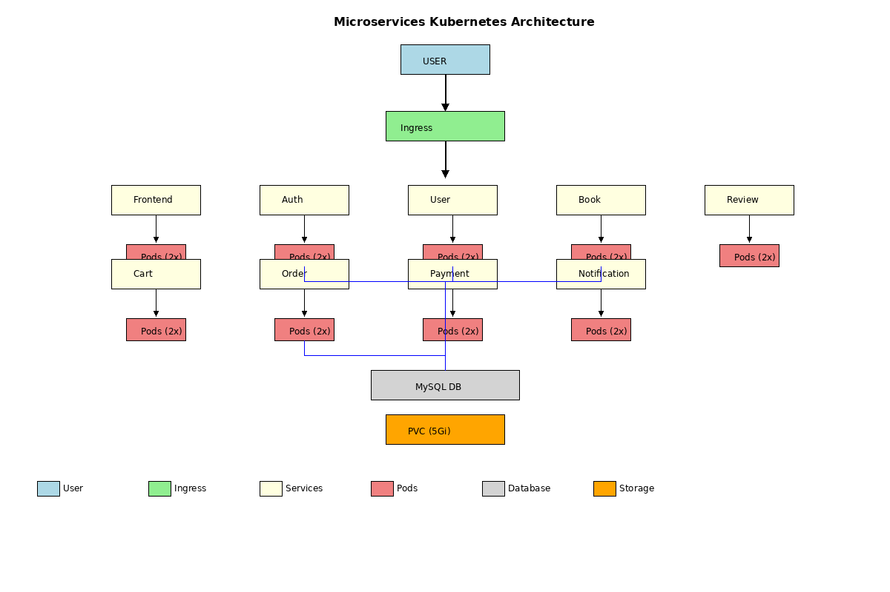

# Microservices Bookstore Application
## Kubernetes Deployment Guide
### Assignment-2 Report

---

## Table of Contents
1. [Application Overview](#1-application-overview)
2. [Architecture Diagram](#2-architecture-diagram)
3. [Kubernetes Components](#3-kubernetes-components)
4. [YAML Files Explanation](#4-yaml-files-explanation)
5. [Deployment Steps](#5-deployment-steps)
6. [Kubernetes Commands Guide](#6-kubernetes-commands-guide)
7. [Verification Steps](#7-verification-steps)

---

## 1. Application Overview

### What the Application Does
This is a comprehensive microservices-based bookstore application consisting of 9 interconnected services:

- **Frontend Service** - User interface and web application
- **Auth Service** - Authentication and authorization management
- **User Service** - User profile and account management
- **Book Service** - Book catalog and inventory management
- **Review Service** - Book reviews and ratings system
- **Cart Service** - Shopping cart functionality
- **Order Service** - Order processing and management
- **Payment Service** - Payment processing and transactions
- **Notification Service** - Email and push notifications
- **MySQL Database** - Centralized data storage for persistence

### Request Flow Inside Kubernetes

#### External User Request:
1. User sends HTTP request through browser
2. Ingress Controller routes based on path/host rules
3. Service Layer load balances to available pods
4. Pod/Container processes the request
5. Database access if needed (MySQL)
6. Response returns through same path

#### Internal Service Communication:
1. Service discovery through DNS resolution
2. Load balancing across healthy pods
3. HTTP/REST API communication between services
4. Direct connection to MySQL service for data

---

## 2. Architecture Diagram



### Key Components:
- **Ingress Controller**: Routes external traffic to appropriate services
- **Services**: Provide stable network endpoints for pods
- **Deployments**: Manage pod replicas and ensure availability
- **ConfigMaps**: Store configuration data
- **Secrets**: Store sensitive data (passwords)
- **PersistentVolumeClaim**: Provides persistent storage for MySQL
- **MySQL Database**: Stateful component with persistent storage

---

## 3. Kubernetes Components

| Component | Purpose | Configuration |
|-----------|---------|---------------|
| Namespace | Resource isolation | `microservices-app` |
| ConfigMap | Non-sensitive config | Service names, DB host |
| Secret | Sensitive data | DB passwords, API keys |
| PVC | Persistent storage | 5Gi for MySQL |
| Deployment | Pod management | 2 replicas per service |
| Service | Network endpoints | ClusterIP type |
| Ingress | External access | NGINX controller |
| MySQL | Database | Stateful with PVC |

---

## 4. YAML Files Explanation

### `namespace.yaml`
Creates logical separation for all application resources.

### `configmap.yaml`
Stores configuration data like service names and database host.

### `secret.yaml`
Securely stores sensitive information like database passwords.

### `pvc.yaml`
Provides persistent storage for MySQL database (5Gi).

### `mysql-deployment.yaml`
Deploys MySQL database with persistent volume mounting.

### `mysql-service.yaml`
Creates internal service endpoint for MySQL database.

### `deployment.yaml`
Deploys all 9 microservices with 2 replicas each.

### `service.yaml`
Creates ClusterIP services for all microservices.

### `ingress.yaml`
Configures external access routing to internal services.

---

## 5. Deployment Steps

### Prerequisites:
- Minikube or Kind cluster installed
- kubectl configured
- Docker installed
- Ingress controller enabled

### Step-by-Step Deployment:

#### 1. Start Minikube:
```bash
minikube start
```

#### 2. Enable Ingress:
```bash
minikube addons enable ingress
```

#### 3. Create Namespace:
```bash
kubectl apply -f k8s/namespace.yaml
```

#### 4. Apply Configuration:
```bash
kubectl apply -f k8s/configmap.yaml
kubectl apply -f k8s/secret.yaml
```

#### 5. Setup Storage:
```bash
kubectl apply -f k8s/pvc.yaml
```

#### 6. Deploy Database:
```bash
kubectl apply -f k8s/mysql-deployment.yaml
kubectl apply -f k8s/mysql-service.yaml
```

#### 7. Deploy Services:
```bash
kubectl apply -f k8s/deployment.yaml
kubectl apply -f k8s/service.yaml
```

#### 8. Configure Ingress:
```bash
kubectl apply -f k8s/ingress.yaml
```

#### 9. Build Docker Images:
```bash
docker build -t auth-service ./auth-service
# (Repeat for all services)
```

#### 10. Load Images to Minikube:
```bash
minikube image load auth-service:latest
# (Repeat for all services)
```

---

## 6. Kubernetes Commands Guide

| Command | Purpose | Example |
|---------|---------|---------|
| `kubectl get pods` | List all pods | `kubectl get pods -n microservices-app` |
| `kubectl get services` | List services | `kubectl get svc -n microservices-app` |
| `kubectl get deployments` | List deployments | `kubectl get deploy -n microservices-app` |
| `kubectl logs` | View pod logs | `kubectl logs -f deployment/auth-service -n microservices-app` |
| `kubectl describe` | Resource details | `kubectl describe pod <pod-name> -n microservices-app` |
| `kubectl exec` | Execute in pod | `kubectl exec -it <pod-name> -n microservices-app -- bash` |
| `kubectl port-forward` | Port forwarding | `kubectl port-forward svc/frontend-service 8080:8080 -n microservices-app` |
| `kubectl scale` | Scale replicas | `kubectl scale deployment auth-service --replicas=3 -n microservices-app` |
| `kubectl apply` | Apply manifests | `kubectl apply -f k8s/ -n microservices-app` |
| `kubectl delete` | Delete resources | `kubectl delete -f k8s/ -n microservices-app` |

---

## 7. Verification Steps

### Pod Verification:
```bash
kubectl get pods -n microservices-app
```
**Expected**: All pods in Running state

### Service Verification:
```bash
kubectl get services -n microservices-app
```
**Expected**: All services with ClusterIP type

### Ingress Verification:
```bash
kubectl get ingress -n microservices-app
```
**Expected**: Ingress with proper address

### Application Access:
```bash
minikube ip  # Get cluster IP
```
Access via: `http://<minikube-ip>/frontend`

### Database Connectivity:
```bash
kubectl exec -it deployment/mysql-deployment -n microservices-app -- mysql -u root -p
```
**Expected**: Successful database connection

### Service Communication:
```bash
kubectl exec -it deployment/auth-service -n microservices-app -- curl http://mysql-service:3306
```
**Expected**: Services can communicate with database

### Logs Verification:
```bash
kubectl logs -f deployment/frontend-service -n microservices-app
```
**Expected**: No error messages in logs

---

## Troubleshooting

### Common Issues:

#### Pods not starting:
- Check image availability: `kubectl describe pod <pod-name>`
- Verify resources: `kubectl get nodes`

#### Service not accessible:
- Check service endpoints: `kubectl get endpoints`
- Verify pod labels: `kubectl get pods --show-labels`

#### Ingress not working:
- Check ingress controller: `kubectl get pods -n ingress-nginx`
- Verify ingress rules: `kubectl describe ingress`

#### Database connection issues:
- Check PVC status: `kubectl get pvc`
- Verify secrets: `kubectl get secrets`

---

## Conclusion

This Kubernetes deployment provides a robust, scalable, and highly available infrastructure for the microservices bookstore application. The architecture ensures fault tolerance, easy scaling, and efficient resource utilization while maintaining security best practices.

The deployment is production-ready and can be easily extended with additional monitoring, logging, and security features as needed.
